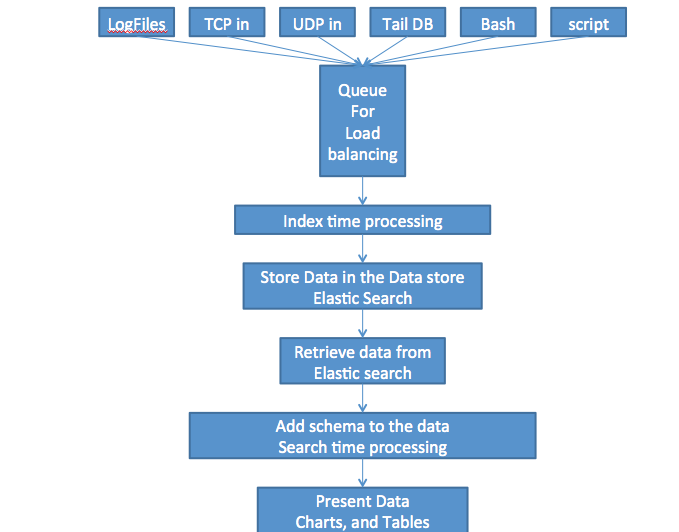
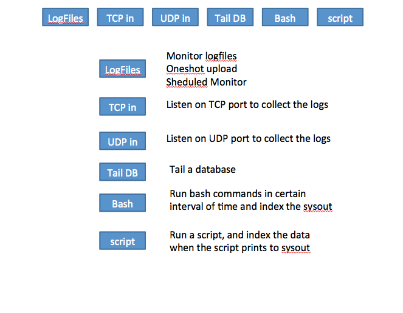
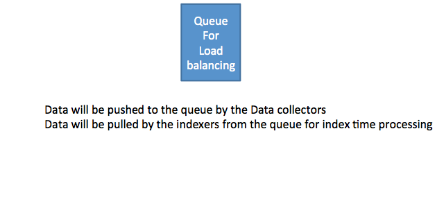
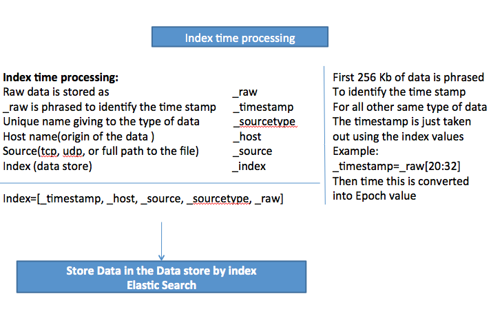
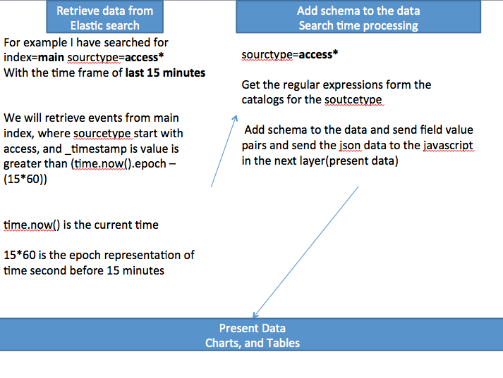

Design
=========
## High level design
For version1 or POC, we mainly use logstash+elasticsearch+kibana.

Later we will:
- Make it more python

- Improve the availablity and scalability

## Design illustration

=========

=========

=========

=========

## Discussion
1. Do we have SPOF problem for queue load?

2. For collecting log, schedule monitor may work for initial version. We need evaluate the performance issue, and autorecover for the failure of monitor process.

3. For indexing time processing, customers may want to define the composition of index by themselves.
