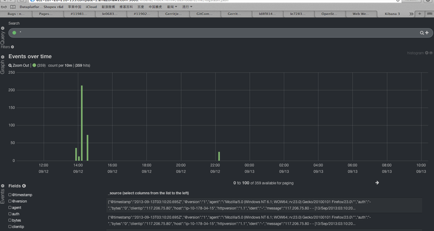

Feng -- "openstack logservice"
=========
- Mission goal for the project 

   Feng is targeted to be chosen as the standard log service of openstack.
   
   The Feng project was started with goal to provide a realtime data analytics engine for OpenStack. It will be design to collect any data from the openstack environment in real-time for IT search, In-depth analytics, and visualization. Feng will Monitor the Core openstack components, as well as the applications running in the virtual machines. Our aim is to design a opensource, easy to use, plug and play data analytics Engine.

   It will be designed to collect unstructured data from any source, and index the data which it collects and make it searchable via a google like search interface. Feng can provide search, analytics and visualization capabilities to data stored in your openstack environment. 
   
    

- Why the project is named as Feng? 

   Feng(FengLei) is a very famous hero in China. 

   His well known habit is recording daily diary. So we use "Feng" here.

## Documentation
| Name | Comment |
|:-----------------|----|
| Design page | [design and discussion](Design.md)|
| Task list | [Current tasks list](TODO.md)|
| Installation guide | [How to install](INSTALL.md)|
| Communitcation conventions | [Lesson learn for remote cooperation](REMOTE_WORK.md)|

## Screenshot

TODO: product screenshot, if it's ready

## Why use this
- TODO: some feature highlighted

## Quick start?
TODO: very short instruction for users to try it

- verified on ubuntu12.4, ...

| Name | Comment |
|:-----------------|----|
| Checkout github | https://github.com/DennyZhang/feng |
|... | ...|

## FAQ
- Why feng is related to openstack?

   We want to contribute feng to openstack community as the standard log service.

# Thanks to

| Name | Email | Contribution |
|:--------|---------------|------------------|
|eashwar | eashwar....@gmail.com | Initiator of the idea. Core developer. India/China. |
|denny | filebat....@gmail.com | Core developer. China/USA.  |
