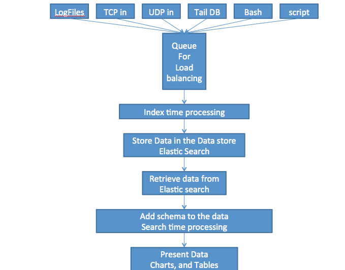

Feng
=========
- Mission goal for the project 

Feng is designed as the open source version of splunk. 
It is targeted as the standard log service for openstack.

Why the project is named as Feng? 

Feng(LeiFeng) is a very famous hero in China. 
His well known habit is recording daily diary. 
So we use "Feng" as the project name for the log service.

## Screenshot

TODO: product screenshot, if it's ready

## Why use this
- TODO: some feature highlighted

## Quick start?
TODO: very short instruction for users to try it

- verified on ubuntu12.4, ...

| Name | Comment |
|:-----------------|----|
| Checkout github | https://github.com/DennyZhang/opensplunk |
|... | ...|

## FAQ
- Why feng is related to openstack?
We want to contribute feng to openstack community as the standard log service.

# Thanks to

| Name | Email | Contribution |
|:--------|---------------|------------------|
|eashwar | eashwar....@gmail.com | Initiator of the idea. Core developer |
|denny | filebat....@gmail.com | Core developer |
