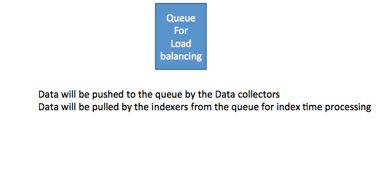
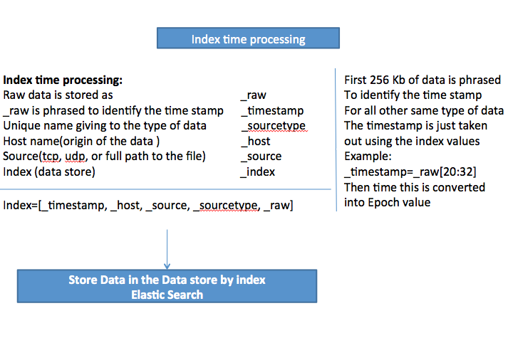
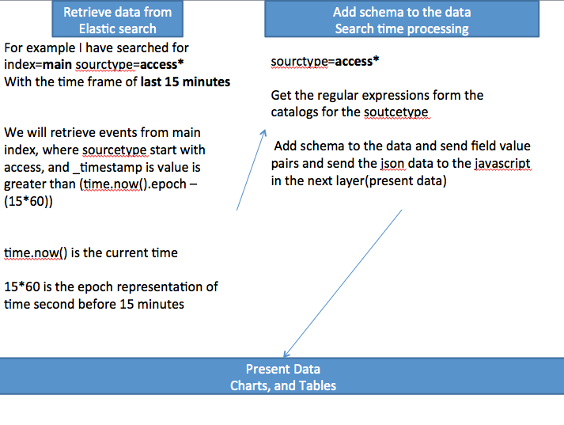

Design
=========

## Discussion
1. Do we have SPOF problem for queue load?

2. For collecting log, schedule monitor may work for initial version. We need evaluate the performance issue, and autorecover for the failure of monitor process.

